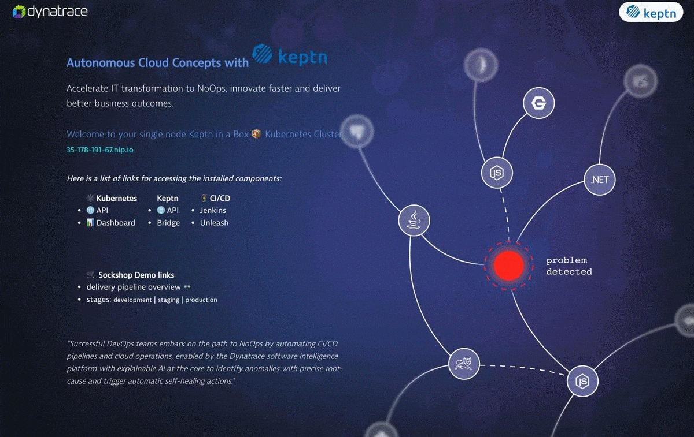
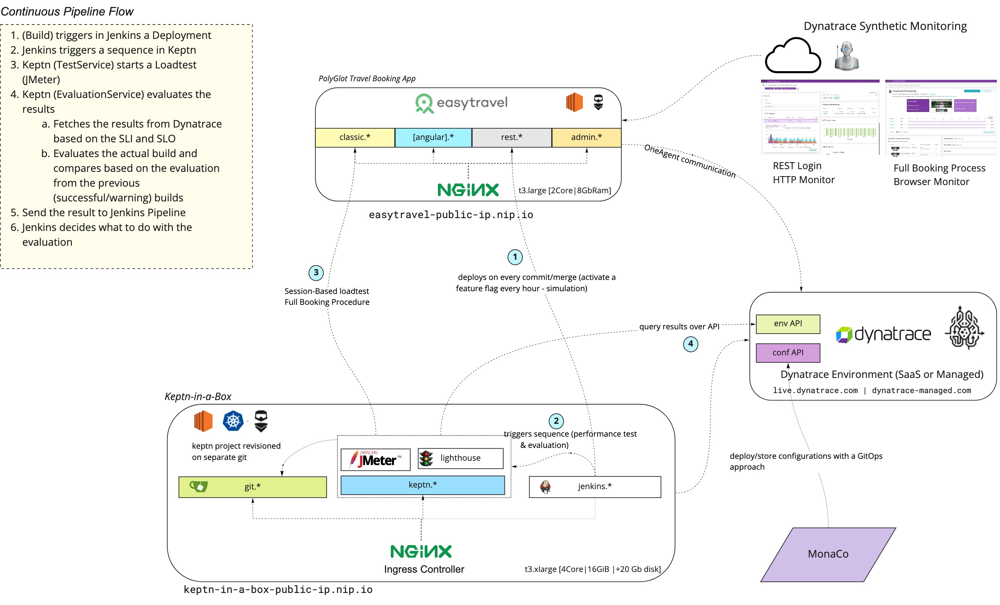
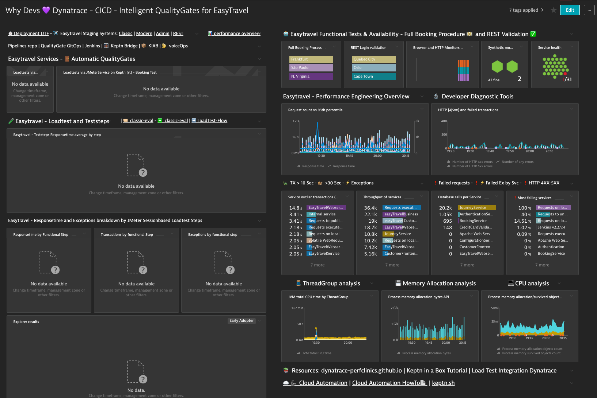
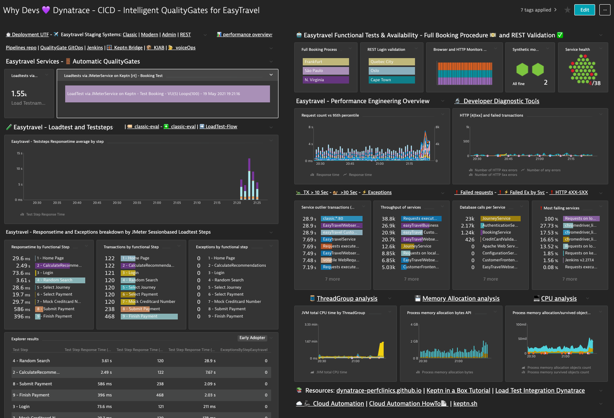

summary: Why Developers Love Dynatrace - Episode 2
id: why-devs-love-dynatrace-2
categories: codelevel, cicd, qualitygates
tags: codelevel
status: Published
authors: sergio.hinojosa
Analytics Account: UA-193960361-1
# Why Devs Love Dynatrace - Episode 2

## Introduction 
Duration: 10

Positive
: [Register now for Episode 2 - Intelligent Quality Gates](https://dynatr.ac/2PbOB3M)    
[Streaming live 📺 on Thursday, May 20th 4pm BST / 5pm CEST / 11am ET](https://dynatr.ac/2PbOB3M) - Bring your questions 🙋‍♂️


Positive
: ***In this Developer Webinar Series we want to bring you from Zero 👶 to Hero 🦸 from Diagnosing Transactions and releases with Dynatrace to building unbreakable delivery pipelines with automatic performance tests and release validation alongside fullstack comparison.***


We will level up our manual testing with continuous validations with the help of Synthetic Testing. Testing REST Microservices and FullBrowser evaluations and tests we **make sure** that the key functionalities we developed works as designed and expected in every release and stage automatically. 


Performance Problems, Scalability issues and Optimizations can be unveiled under load 🔥. Exactly where the application is needed the most (under load) is where it should NOT fail. It’s important to unveil the limits of each application, understand if it can scale horizontally and/or vertically so it can be sized properly and not waste resources (money) just because of not knowing the limits of a system. This is why automated quality gates with automated performance testing, validation and release comparison is so important. Make sure automatically that every release works, every important KPI is fulfilled such as business, architecture, infrastructure and performance SLOs (Service Level Objectives) by every pull requests or merge on a branch. We will understand how the Quality Gate works, how the Load test is automatically integrated in Dynatrace and how all systems such as AzureDevOps, the application, Keptn and Dynatrace form an ecosystem and are tight together.
In this Episode we will explain the CICD environment, the QualityGates, the session-based load test, the SLI/SLOs and best practices on them such as validate the end2end functionality of a system, the vertical stack and shift business KPIs into the validation. We will also learn how the integration works and the foundations of loadtest analysis with Dynatrace.


Positive
: This systematic and generic approach can be applied to any software that Dynatrace monitors and any CI/CD pipeline that our customers may use, meaning we can speed up 🚀 their delivery up to 80% while ensuring the functionality and a higher level of quality of their released software ✅.

>In Episode 2 of this Performance Clinic Series, we will set up a continuous CICD Pipeline with an automatic & Intelligent QualityGate. We want to simulate on every git merge or git commit on a branch to automate performance tests with a Full-Stack End-End Evaluation of each release.




## Automating Tests and Validations with Synthetic Monitoring

## REST Sign-In Validation & Availability with Dynatrace

## Full Booking Browser Test, Validation & Availability with Dynatrace

## Intelligent Quality Gates

## The Set-Up



## About Keptn in a Box

We will set up a Single Node Kubernetes Server, for this we will use Keptn in a Box. Keptn-In-A-Box is a Bash script that will convert a plain Ubuntu machine in a Single Node Kubernetes Cluster with Keptn installed and configured (among other cool features which will set sail for your autonomous cloud journey). The script is programmed in a modular way so you can select the 🧩 **installationBundle**. 

*Keptn-in-a-Box is a 🚀 rocket launcher for enabling tutorials or workshops in an easy, fast and ressource efficient way.*

In a matter of minutes you'll have a fully configured **Single Node Kubernetes Cluster** for learning [Keptn tutorials](https://tutorials.keptn.sh), trying out new functionalities, building your own pipeline or even delivering **Performance-as-a-Self-Service**. 

Positive
: Spend **more** time **innovating** 😄⚗️ and *less* time *configuring* 😣🛠


If you want to learn more about [Keptn](keptn.sh) or [Keptn in a Box](https://tutorials.keptn.sh/tutorials/keptn-in-a-box-08/) we recommend you to start with this [tutorials](https://tutorials.keptn.sh/)


## Setting up Keptn-in-a-Box with DevLove Bundle

#### Get your Ubuntu Box. 
For Sizing and how to get a free Cloud Account check [out this page](https://tutorials.keptn.sh/tutorials/keptn-in-a-box-08/index.html#1). We recommend though to use an xlarge with 20 gigs of disk space.

#### 💻 Login to your Ubuntu
When your Ubuntu machine is up and running, let's log in into it.
```bash
ssh yourusername@the-bind-ip-or-dns
```

#### Download `keptn-in-a-box.sh`
Now let's download the `keptn-in-a-box.sh` file and make it executable.
```bash
curl -O https://raw.githubusercontent.com/keptn-sandbox/keptn-in-a-box/release-0.8.2/keptn-in-a-box.sh
chmod +x keptn-in-a-box.sh
```
### Enter your Dynatrace Credentials
Get your Dynatrace Tokens, in Episode 1 we already created an API and a PaaS Token. 
In the `keptn-in-a-box.sh` file enter your credentials under the section "Define Dynatrace Environment". For editing the file use `vi` or `vim`.

```bash
# ---- Define Dynatrace Environment ---- 
# Sample: https://{your-domain}/e/{your-environment-id} for managed or https://{your-environment-id}.live.dynatrace.com for SaaS
TENANT="https://mytenant.live.dynatrace.com"
PAASTOKEN="myDynatracePaaSToken"
APITOKEN="myDynatraceApiToken"
```

Negative
: For the sake of simplicity EasyTravel and Keptn-in-a-Box will be running on Cloud Instances with a public ip. Hence the Domain variable is not needed to be configured since it will be generated automatically and the IP's will be converted to Magic IPs with nip.io. A Magic IP allows us to access multiple services with a single ip.

### Select the DevLove Installation Bundle

🧩 We created an **installation Bundle** for this PerformanceClinic called **installationBundleDevLove** 😎. Scroll down to the Installation Bundle section, comment out the Demo and add the `installationBundleDevLove` like this:

```bash
# ==================================================
#    ----- Select your installation Bundle -----   #
# ==================================================
# - Comment out if selecting another bundle
#installationBundleDemo

# - Comment out if only want to install the Performance Clinic 'Why Devs love Dynatrace' Bundle
installationBundleDevLove
```
More about installation Bundles [here](https://tutorials.keptn.sh/tutorials/keptn-in-a-box-08/index.html#7) 

### Execute the script
Yay! now let's see Keptn-in-a-box in action 🤘!. Run the script with sudo rights and send the process to the background.
```bash
sudo bash -c './keptn-in-a-box.sh &'
```
This will create a single node kubernetes cluster for you already configured for this performance clinic.

Negative
: If you face any issues don't hesitate in contacting us. [Here is a troubleshooting guide and multiple ways to reach us.](https://tutorials.keptn.sh/tutorials/keptn-in-a-box-08/index.html#10)

### 🔍Inspect the script at runtime
To inspect how the installation is going, type
```bash
less +F /tmp/kiab-install.log
```
This will open the installation log and read from the input stream. To exit just type `CTRL + C` and then `quit`.


### Access your services
At the end of the installation file you should see something similar:

```bash
[Keptn-In-A-Box|INFO]|============ Installation complete :) ============
[Keptn-In-A-Box|INFO]|______________________________________________________________________
[Keptn-In-A-Box|INFO]|>->-> It took 9 minutes and 32 seconds <-<-<|
[Keptn-In-A-Box|INFO]|======================================================================
[Keptn-In-A-Box|INFO]|============ File System usage ============
[Keptn-In-A-Box|INFO]|______________________________________________________________________
[Keptn-In-A-Box|INFO]|>->-> Disk used size 1K Blocks: 10969472 <-<-<|
[Keptn-In-A-Box|INFO]|>->-> Disk used size in IEC Format: 11G <-<-<|
[Keptn-In-A-Box|INFO]|======================================================================
[Keptn-In-A-Box|INFO]|============ Keptn & Kubernetes Exposed Ingress Endpoints ============
[Keptn-In-A-Box|INFO]|______________________________________________________________________
[Keptn-In-A-Box|INFO]|>->-> Below youll find the adresses and the credentials to the exposed services. <-<-<|
[Keptn-In-A-Box|INFO]|>->-> We wish you a lot of fun in your Autonomous Cloud journey! <-<-<|
NAMESPACE      NAME                   CLASS    HOSTS                                 ADDRESS     PORTS     AGE
default        k8-api-ingress         <none>   api.kubernetes.18-130-223-01.nip.io   127.0.0.1   80, 443   5m9s
kube-system    k8-dashboard-ingress   <none>   kubernetes.18-130-223-01.nip.io       127.0.0.1   80, 443   5m9s
istio-system   istio-ingress          <none>   *                                     127.0.0.1   80, 443   5m8s
keptn          api-keptn-ingress      <none>   keptn.18-130-223-01.nip.io            127.0.0.1   80, 443   3m5s
default        homepage-ingress       <none>   18-130-223-01.nip.io                  127.0.0.1   80, 443   2m48s
jenkins        jenkins-ingress        <none>   jenkins.18-130-223-01.nip.io          127.0.0.1   80, 443   84s
git            gitea-ingress          <none>   git.18-130-223-01.nip.io              127.0.0.1   80, 443   86s
[Keptn-In-A-Box|INFO]|======================================================================
[Keptn-In-A-Box|INFO]|============ Jenkins-Server Access ============
[Keptn-In-A-Box|INFO]|______________________________________________________________________
[Keptn-In-A-Box|INFO]|>->-> Username: keptn <-<-<|
[Keptn-In-A-Box|INFO]|>->-> Password: keptn#R0cks <-<-<|
[Keptn-In-A-Box|INFO]|======================================================================
[Keptn-In-A-Box|INFO]|============ Git-Server Access ============
[Keptn-In-A-Box|INFO]|______________________________________________________________________
Domain has been passed: 18-130-223-01.nip.io
Username: keptn
Password: keptn#R0cks
GIT-Server: http://git.18-130-223-69.nip.io
[Keptn-In-A-Box|INFO]|>->-> ApiToken to be found on ~/keptn-in-a-box/resources/gitea/keptn-token.json <-<-<|
[Keptn-In-A-Box|INFO]|>->-> For migrating keptn projects to your self-hosted git repository afterwards just execute the following function: <-<-<|
[Keptn-In-A-Box|INFO]|>->-> cd ~/keptn-in-a-box/resources/gitea/ && source ./gitea-functions.sh; createKeptnRepoManually {project-name} <-<-<|
[Keptn-In-A-Box|INFO]|======================================================================
[Keptn-In-A-Box|INFO]|============ Workshop User Access (SSH Access) ============
[Keptn-In-A-Box|INFO]|______________________________________________________________________
[Keptn-In-A-Box|INFO]|>->-> ssh student@18-130-223-01.nip.io <-<-<|
[Keptn-In-A-Box|INFO]|>->-> Password: secr3t <-<-<|
[Keptn-In-A-Box|INFO]|======================================================================
[Keptn-In-A-Box|INFO]|============ Keptn in a Box release-0.8.2 installation finished. ============
[Keptn-In-A-Box|INFO]|______________________________________________________________________
[Keptn-In-A-Box|INFO]|>->-> Good luck in your Autonomous Cloud Journey!! <-<-<|
[Keptn-In-A-Box|INFO]|>->-> If you faced an issue or just want to say hi, come by @ https://keptn.slack.com/ <-<-<|
```

Positive
: As you can see there are quite some services already configured for you. We have set up a full functional Kubernetes cluster with Keptn, Jenkins and a GIT Server.  It is also being monitored with Dynatrace and it has a set of clients configured so you can play around and deploy anything else you might need.

#### 💻 Configured clients
The clients are configured and ready to use `helm`, `istioctl`,`kubectl`, `docker` and `keptn`. You need to reload the shell (if you have not done it since the installation) so the paths can be found. 


## Environment Configuration (MonACo)

Monaco stands for `Monitoring As Code`. In Dynatrace we love to automate. With monaco we can automate the configuration of one or multiple environments following a GitOps approach. 

Positive
: Spend more time innovating 😄⚗️ and less time configuring 😣🛠

Positive
: Having an environment where automatically every Host, Process, Namespace, Transaction etc... gets categorized automatically (via automated tagging) is a ver powerful and useful approach that should be used on every DevOps practice. With Dynatrace you can use filters and chain of filters to find the needle in the haystack in a matter of seconds.

We will import the following configurations following a GitOps approach:

- [Management Zones](https://www.dynatrace.com/support/help/how-to-use-dynatrace/management-zones/) 
- [Automated Tagging](https://www.dynatrace.com/support/help/how-to-use-dynatrace/tags-and-metadata/setup/how-to-define-tags/#automated-approach)
- [Request Attributes](https://www.dynatrace.com/support/help/how-to-use-dynatrace/transactions-and-services/basic-concepts/request-attributes/)
- [Dashboards](https://www.dynatrace.com/support/help/how-to-use-dynatrace/dashboards-and-charts/dashboards/create-dashboards/)
- [Application Definition](https://www.dynatrace.com/support/help/how-to-use-dynatrace/real-user-monitoring/setup-and-configuration/web-applications/initial-configuration/define-your-applications-via-the-my-web-application-placeholder/)
- [Calculated Service Metrics](https://www.dynatrace.com/support/help/how-to-use-dynatrace/transactions-and-services/service-monitoring-settings/calculated-service-metric/)
- [Load Testing Integration](https://www.dynatrace.com/support/help/setup-and-configuration/integrations/third-party-integrations/test-automation-frameworks/dynatrace-and-load-testing-tools-integration/)

### Download Monaco
[Dynatrace Monitoring as Code](https://github.com/dynatrace-oss/dynatrace-monitoring-as-code)

Download the [latest release (depending the architecture of your OS)](https://github.com/dynatrace-oss/dynatrace-monitoring-as-code/releases/latest) and add the binary to your path.

### Check that you can execute the binary
```bash
monaco --help
```
### Clone the GitOps configuration
```bash
git clone https://github.com/dynatrace-perfclinics/why-devs-love-dynatrace
```

Negative
: if you have already cloned it (from Episode 1) do a `git pull` to fetch the latest commit.

### Navigate to the GitOps directory
```bash
cd why-devs-love-dynatrace/monaco/devlove 
```

### Add your variables to a helper script `set_dt_variables.sh`
```bash
vi set_dt_variables.sh
```

My file looks something like this:
```bash
# Sample: https://{your-domain}/e/{your-environment-id} for managed or https://{your-environment-id}.live.dynatrace.com for SaaS
DT_TENANT_URL=https://gab265.dynatrace-managed.com/e/XXXXXXXXX
# https://www.dynatrace.com/support/help/shortlink/token#create-an-api-token-
# Token in format dt0c01.STXXXX....
DT_API_TOKEN=dt0c01.2UMCWXXXXXX
DT_PAAS_TOKEN=
# DT_USER (Your login username in the environment, Click on the top right on the people icon and see your id, it can be your email or a username)
DT_USER=admin

# Magic IP for easytravel. Example if public ip == 1.2.3.4 then Magic IP => 1-2-3-4.nip.io 
MIP_EASYTRAVEL=10-123-100-10.nip.io

# Magic IP for KIAB (Keptn in a Box). Example if public ip == 1.2.3.4 then Magic IP => 1-2-3-4.nip.io 
MIP_KIAB=10-123-100-11.nip.io
```

Negative
: Note that we added the variable for the Magic IP of EasyTravel and Keptn in a Box. This variables are needed for creating and automating Synthetic Tests as well as setting up links in a Dashboard so you can easily access all your services. **⚠️ Important:** it is important that you add the magic ips in the following notation **1-2-3-4.nip.io**. Replace the dots for slashes and don't add the protocol otherwise the links for the services and synthetic tests to the various endpoints won't work as expected. 

### Load the variables in the shell
```bash
source set_dt_variables.sh
```
### Execute Monaco

```bash
monaco deploy -e environment.yaml -v
```
Positive
: By not specifying a project (like `--project episode 1`)we run all projects (directories) found. We will actualize configurations for example for Episode 1 and as well run any new configuration for Episode 2.

## Set up your unbreakable CICD Pipeline

Once you have run `monaco` you'll notice that there is a CICD Dashboard linking all systems and showing an overview of the health of EasyTravel, it's Synthetic Monitors and the status and metrics for the Load Test integration. 




### Trigger the Jenkins Pipeline
On the top left there is a link to your Jenkins server. Click on it. 


The login credentials to your Jenkins server are:
```bash
Username: keptn
Password: keptn#R0cks
```

After you have entered your server, click on "Install suggested plugins" 


You'll notice a set of preconfigured pipeles. We will focus on two of them, **easytravel-continuous-deployment** and **easytravel-deployment-scheduler**


The deployment is the actual pipeline integrating with Keptn and the Scheduler will be triggered each hour with a different feature flag. There are 5 problems that we will activate and a deployment **Zero** which is the deployment without bad code changes. 

The easiest way (that I know of) for setting up a continuous build each hour with your parameters is to recreate **easytravel-deployment-scheduler**. Click on the top left on **New Item**. 


Give it a name, something like "easytravel-developers" is just fine, select pipeline and click ok.

Scroll to the bottom on the Pipeline section, and in **pipeline script** copy and paste this [Jenkins pipeline](https://raw.githubusercontent.com/dynatrace-perfclinics/devlove-easytravel-pipelines/master/pipelines/jenkins/easytravel-scheduler.Jenkinsfile). Which is basically the source of the **easytravel-deployment-scheduler** we just saw in our pipelines before. 


At the top replace the default value of the DeploymentURI variable `easytravel-public-ip.nip.io` for the magic domain of your EasyTravel instance with the notation we have been using for example `10-123-123-123.nip.io` then click **Save**


Now click on the small arrow next to the pipeline and trigger it by clicking **build now**


Positive
: You will trigger the first build and also subsequent builds since this pipeline has a cron job for the starting of each hour. Depending on the time the pipeline will set up a different problem pattern or feature flag and trigger the **easytravel-continuous-deployment** pipeline. We are simulating Developers being Developers pushing a different code base and we will load test each release and evaluate it with the quality gate.   

If you go back to your Loadtesting Dashboard in Dynatrace you'll notice that all the Loadtest are tracked automatically. How cool 😎 is that? We have set up now a continuous unbreakable pipeline with **Performance as a Service** and **Intelligent Quality Gates**.




